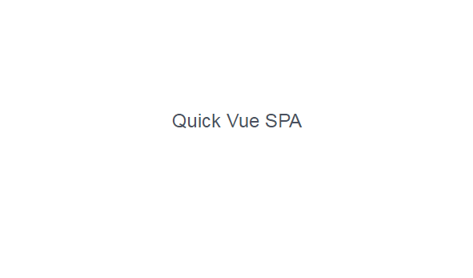

# Quick-Vue-SPA
Quickly create a typical Vue SPA project

## usage
```js
npm i -g quick-vue-spa

quick-vue-spa init vue-demo

cd vue-demo

npm install

npm run dev
```
that is it.

## result
<p>
  
</p>

## License
under MIT license