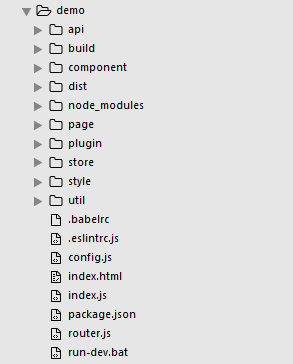

# Quick-Vue-SPA
Quickly create a typical Vue SPA project

## Usage
```js
npm i -g quick-vue-spa

quick-vue-spa init vue-demo

cd vue-demo

npm install

npm run dev
```
that is it.

## Result
<p>
  
</p>

## App Structure
your app structure would be like this
<p>
  
</p>

## License
under MIT license